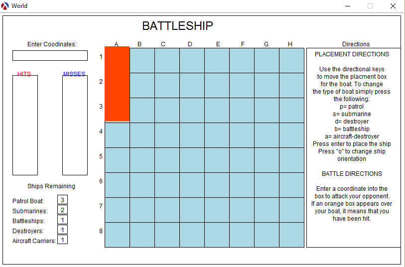

# Battleship Racket Clone 

This is the final project from the Fall 2013 UDel CISC108: Intro
to Computer Science I course.

## How to Run:
1. Download Racket from: [https://racket-lang.org/](https://racket-lang.org/)
2. Clone or Download this repo and double-click the "Battleship.rkt" file
3. Click the "Run" button when the file loads into DrRacket

